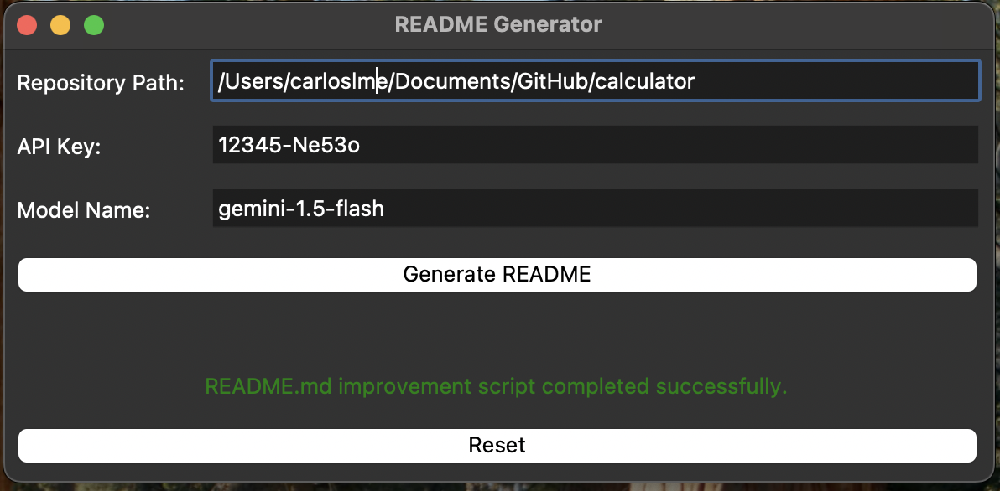

# IDP Software Builder

> TODO: Add the project description

## Overview

IDP aims to bridge the gap between research and practical application by automating the process of transforming a research-oriented tool into a professional-grade product. This automation is achieved by leveraging the power of Large Language Models (LLMs) like Ollama, along with task management systems like Celery.

The core idea behind IDP is to **reduce the manual effort required to bring a research tool to a professional level**. It focuses on automating tasks such as:

* **Documentation:** Generating comprehensive documentation, including a README file, CONTRIBUTING guidelines, a CHANGELOG, LICENSE details, and SECURITY information.
* **Project Structure:** Establishing a well-defined and modular project structure with logical folder hierarchies and standard naming conventions.
* **Testing:** Implementing automated unit and integration tests to ensure code quality and reliability.
* **Version Control:** Adhering to best practices for version control using platforms like Git, including well-documented branching strategies and informative commit messages.
* **Code Quality:** Enforcing code style guidelines and utilising linters to maintain consistency and readability.
* **Security:** Implementing measures to protect sensitive information and ensure the secure handling of credentials.

## How IDP Works

IDP employs a streamlined workflow that utilises LLMs and Celery to automate the process of analysing code and generating documentation. The typical workflow involves:

1. **User Request:** A user initiates a request to analyse a Python code repository related to energy system modelling.
2. **API Handling:** The request is received by an API, which acts as the central point for managing interactions.
3. **Code Reading:** The API delegates the task of reading the Python code to a "Repository Reader" component, managed by Celery for efficient background processing.
4. **LLM Analysis:** The "Repository Reader" sends the extracted code to an "LLM Interactor," which communicates with a local Ollama instance. Ollama analyses the code and provides insights about its structure and functionality.
5. **Documentation Task:** Based on the LLM's analysis, the "LLM Interactor" triggers the creation of a documentation task in Celery.
6. **Documentation Generation:** A "Builder" worker picks up the documentation task and uses the LLM's output to generate the required documentation files.
7. **Documentation Storage:** The generated documentation is saved back to the repository.

## Architecture

IDP's architecture consists of several key components:

* **User Interface:** Enables users to interact with the system and initiate analysis requests.
* **LLM Control Manager:** Oversees the interaction with the LLM (Ollama).
* **Workers:** Handle tasks such as code reading, LLM interaction, and documentation generation.
* **LLM API Connector:** Facilitates communication with the LLM.
* **LLM Logging:** Tracks LLM responses and other relevant information.
* **Model Registry:** Manages the available LLM models.
* **Databases:** Store configuration settings, temporary data, and potentially other relevant information.

## Key Features

* **Automated Documentation:** IDP automates the generation of essential documentation, including README, CONTRIBUTING, CHANGELOG, LICENSE, and SECURITY files, reducing manual effort. [1]
* **LLM-Powered Analysis:** Leveraging the power of LLMs to understand and analyse Python code related to energy system modelling. [2, 3]
* **Celery-Based Task Management:** Ensures efficient and asynchronous processing of tasks, enhancing performance and responsiveness. [3]
* **Modular Architecture:** A well-defined architecture with distinct components allows for flexibility and scalability. [4]

## Benefits

* **Increased Efficiency:** Automates tedious tasks, freeing up researchers to focus on core development activities.
* **Improved Documentation:** Generates consistent and high-quality documentation, enhancing usability and maintainability.
* **Faster Development Cycles:** Streamlines the process of bringing research tools to a professional level, accelerating the development lifecycle.

***

## Running

### 1. Setup (Prerequisites)

* **Python 3.11+:** Ensure you have Python 3.11 or a later version installed. You can download it from the official Python website.
* **Package Manager:** A package manager like `pip` is required to install the necessary Python packages. It is usually included with Python installations.
* **Virtual Environment:** It's highly recommended to create a virtual environment to isolate your project's dependencies and prevent conflicts with other Python projects on your system. You can use tools like `venv` or `conda` to create and manage virtual environments.

### 2. How to Run

1. **Clone the Repository:**

    ```bash
    https://github.com/carloslme/tum-idp
    ```

2. **Navigate to the Project Directory:**

    ```bash
    cd tum-idp
    ```

3. **Install Dependencies:**

    ```bash
    pip install -r requirements.txt
    ```

    This command will install all the required Python packages listed in the `requirements.txt` file.

4. **Configure Ollama:**
    * You need to install Ollama, follow the instructions in the [official website](https://github.com/ollama/ollama?tab=readme-ov-file#macos).
    * Run `ollama run llama3.2` to download `llama3.2` version.

4.1 **Gemini:**
    if you are using Gemini API, ensure you have an account and an API key before running the code.

5. **Start the Application:**
    * **Start the server**
    Run the following command to start FastAPI:

    ```bash
    python -m app.main
    ```

    > Note: this bash command correctly handles relative imports.

    * **Start the GUI using TKinter**
    Run the following command to start the GUI:

    ```bash
    python3 app/gui/main.py 
    ```

6. **Access the application via GUI**
    * Open the new window created by Tkinter, fill out the fields and click on the `Generate README` button.
    * If everything is correct, you will see a message that says `README.md improvement script completed successfully.` in green color. Now you can go to the path you provided and check the `README.md` file created.
    * You can reset the fields by clicking on the `Reset` button.

        

7. **Access the application via browser:**  
    Once the application is running, you can access the REST API through `http://127.0.0.1:8000/docs` for a locally running application.

    * Click on the `/analyze` endpoint and provide the folder with your code.

        ```bash
        {
        "repository_path": "/Users/carloslme/Documents/GitHub/calculator"
        }
        ```

        This will read all the Python files, generate and return a JSON file that looks like this:

        ```
            {
            "message": "Analysis initiated"
            }
        ```

        ```markdown
        **Code Analysis and Documentation**
        =====================================

        ### Overview

        This Python code is designed to take two numbers as input from the user, perform basic arithmetic operations on them, and then display the results.

        ### Code Structure

        The code consists of four main sections:

        1.  **User Input**: The code uses the built-in `input()` function to prompt the user to enter two numbers.
        2.  **Arithmetic Operations**: The code performs addition, subtraction, multiplication, and division on the input numbers using the corresponding operators (`+`, `-`, `*`, `/`).
        3.  **Result Display**: The results of the arithmetic operations are displayed to the user using f-strings for formatting.

        ### Code Quality and Best Practices

        The code is concise and easy to read. However, there are a few areas that can be improved:

        *   **Error Handling**: The code does not handle cases where the user enters non-numeric input. Consider adding try-except blocks to handle such scenarios.
        *   **Input Validation**: The code assumes that the user will enter two numbers. Consider adding checks to ensure that the inputs are valid (e.g., non-negative numbers).
        *   **Code Organization**: The code can be organized into a function or class to make it more modular and reusable.

        ### Code Refactoring

        Here's an example of how the code can be refactored to improve its structure, readability, and maintainability:

        ```python
        def get_number(prompt):
            """Get a number from the user."""
            while True:
                try:
                    return float(input(prompt))
                except ValueError:
                    print("Invalid input. Please enter a number.")

        def calculate(num1, num2):
            """Perform basic arithmetic operations on two numbers."""
            return {
                "Sum": num1 + num2,
                "Difference": num1 - num2,
                "Product": num1 * num2,
                "Quotient": num1 / num2 if num2 != 0 else float('inf')
            }

        def main():
            """Main function."""
            num1 = get_number("Enter first number: ")
            num2 = get_number("Enter second number: ")

            results = calculate(num1, num2)

            for operation, result in results.items():
                print(f"{operation}: {result}")

        if __name__ == "__main__":
            main()
        ```

    * The enpoint `generate-readme` will use Gemini to analyze the repository. Provide the following parameters as input:

        ```bash
        {
            "repo_path": "path/to/your/file",
            "api_key": "your_api_key",
            "model_name": "gemini-1.5-flash"
        }
        ```

        The output will look like this:

        ```bash
        {
            "status": "success",
            "message": "README.md improvement script completed successfully."
        }
        ```

   ### Conclusion

    The refactored code is more modular, readable, and maintainable. It includes input validation, error handling, and a clear separation of concerns. The `get_number()` function ensures that the user enters valid numbers, while the `calculate()` function performs the arithmetic operations. The `main()` function coordinates the entire process.
