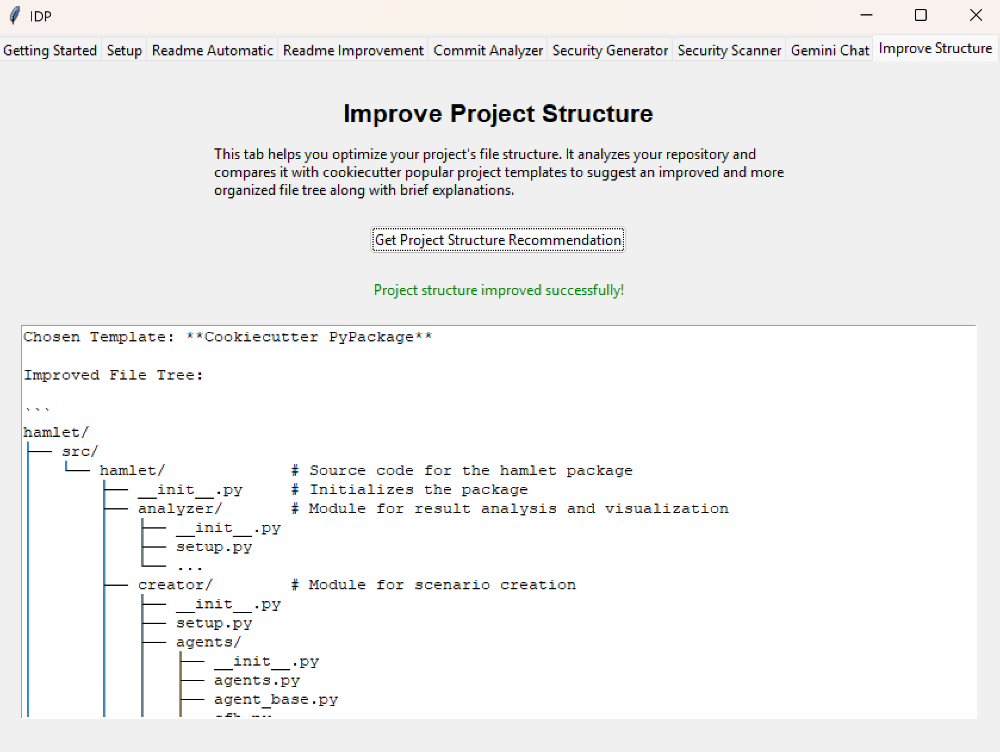

Improve Project Structure
=========================

* **Functionality:** Uses the Gemini AI model to analyze the repository's content and purpose, compares it against a predefined list of standard project templates (e.g., Cookiecutter templates for Python packages, web apps, data science), recommends the most suitable template, and generates a suggested file tree layout.

* **Key UI Elements:**
    * Get Project Structure Recommendation Button: Initiates the analysis process. It triggers the repository processing, context upload, and the LLM call with the template comparison prompt.
    * Output Text Area: A tk.Text widget where the final suggested file tree structure and the name of the recommended template are displayed.

* **Usage Process:**
    * User clicks the Get Project Structure Recommendation button.
    * The Status Label updates to indicate processing has started.
    * (Background: Repository processed into a text file, uploaded to Gemini).
    * (Background: A prompt containing template descriptions and the uploaded context is sent to Gemini).
    * (Background: Gemini analyzes, selects a template, and generates the suggested structure).
    * The recommended template name and suggested file tree are displayed in the Output Text area.
    * The Status Label updates to show success or failure.
    * The suggested structure is also saved to suggested_project_structure.md.
* **Output:**
    * The recommended template name and the suggested file tree structure are displayed in the text area within the tab.
    * The suggested structure is also saved to a  local Markdown file (suggested_project_structure.md).
* **Dependencies:** Requires a valid Gemini API key and repository configured in the Setup tab. The effectiveness of the suggestions depends on the quality of the original repository content and the capabilities of the selected LLM.