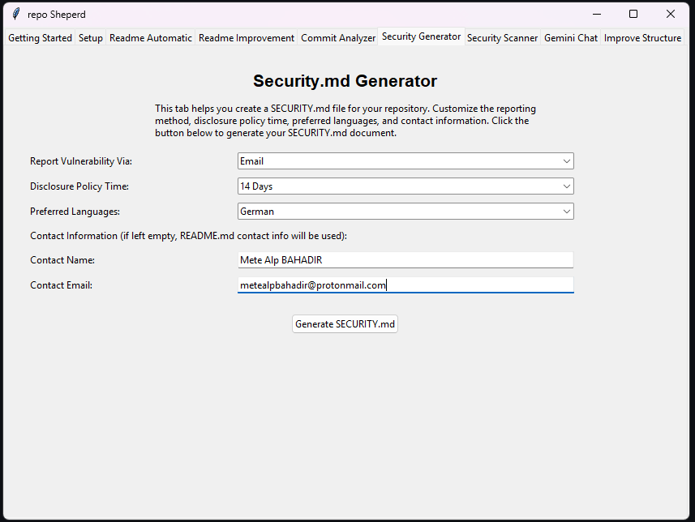

Security Policy (`SECURITY.md`) Generator 
===================================================

* **Functionality:** Generates a `SECURITY.md` file using the selected ai model. It takes user preferences for security reporting procedures, disclosure timelines, and communication languages. It can optionally incorporate contact information provided by the user or infer it from the repository's `README.md` file (if contact details are left blank in the UI). It also uses the repository's `README.md` and `LICENSE` file (if available) as context to inform the generated policy, particularly for license information.

* **Key UI Elements:**
    * **Report Vulnerability Via Dropdown:** Allows users to select the preferred method for receiving vulnerability reports (e.g., "Email", "Only With Issues", "Other"). Selecting "Other" enables custom text input in the dropdown field.
    * **Disclosure Policy Time Dropdown:** Sets the expected timeframe for acknowledging and addressing vulnerability reports (e.g., "14 Days", "30 Days", "Custom"). Selecting "Custom" enables custom text input.
    * **Preferred Languages Dropdown:** Specifies the language(s) preferred for security communications (e.g., "English*", "German", "Other"). Selecting "Other" enables custom text input.
    * **Contact Name Entry:** Optional field to specify the primary security contact person or team name.
    * **Contact Email Entry:** Optional field to specify the security contact email address. (If both contact fields are empty, the generator is instructed to use contact info found in the README).
    * **Generate SECURITY.md Button:** Initiates the generation process using the configured options and repository context.
    * **Status Label:** Displays feedback messages about the generation process (e.g., "Generating...", "Success", "Error").

* **Usage Process:**
    * User selects the desired options from the "Report Vulnerability Via", "Disclosure Policy Time", and "Preferred Languages" dropdowns. If "Other" or "Custom" is chosen, the user types their specific preference directly into the dropdown box.
    * (Optional) User enters contact information in the "Contact Name" and "Contact Email" fields.
    * User clicks the `Generate SECURITY.md` button.
    * The `Status Label` updates to indicate processing, and the mouse cursor may change to indicate waiting.
    * (Background: The application accesses the configured repository - cloning if remote).
    * (Background: `README.md` and `LICENSE` (if present) files are read, converted to text, and uploaded to ai model for context).
    * (Background: A detailed prompt is constructed, including the user's selections, contact instructions, and references to the uploaded context files, and sent to the sellected ai model model).
    * (Background: sellected ai model generates the `SECURITY.md` content based on the prompt and context).
    * The generated content is saved to a file named `SECURITY.md`.
    * The `Status Label` updates to show success or failure, and a message box confirms the save location.

* **Output:**
    * A `SECURITY.md` file containing the generated security policy.
        * For **local** repositories, the file is saved directly into the root directory of the configured repository path.
        * For **remote** repositories, the file is saved in the application's root directory (where the main script runs), as the cloned repository is temporary.

* **Dependencies:** Requires a valid API key and a repository path/URL configured in the `Setup` tab. The quality and relevance of the generated `SECURITY.md` depend on the clarity of user selections, the information present in the repository's `README.md` and `LICENSE` files (if used for context), and the capabilities of the selected sellected ai model model.
