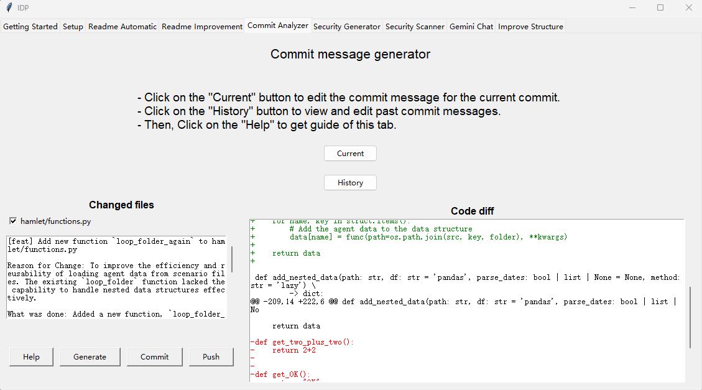

Current Commit Message Generation
=================================

Introduction
------------

This section introduces the **Current Commit Message Refinement** feature in the **Commit Analyzer** tab.

Left Frame: Changed Files
-------------------------

A list of changed files will be displayed here.  
You can select which files you want to include in the commit.

**Help**: Display basic instructions for using this tab.

**Generate**: Generates a commit message based on the code diff of the selected files.  
The generated message will be displayed above, and you can edit it as needed.

**Commit**: Commit the selected files with the generated commit message.

**Push**: Push the committed changes to the remote repository.

Right Frame: Code Diff
----------------------

This frame displays the code differences (diff) for the selected files.

- **Green text** indicates lines of code that have been added.  
- **Red text** indicates lines of code that have been removed.
