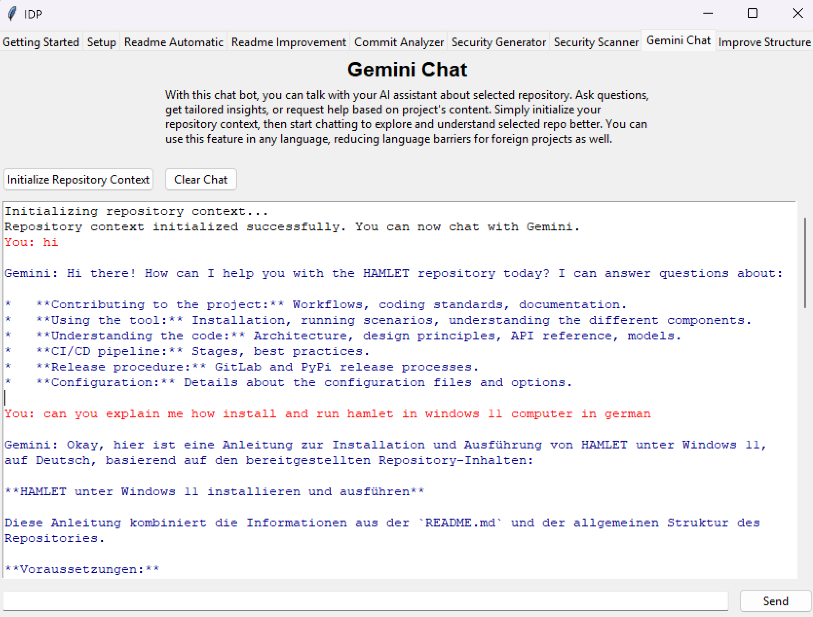

Gemini Chat
===========

* **Functionality:** Allows users to ask questions about the selected repository in natural language and receive contextual answers from an AI assistant (Gemini). It requires an initial step to process and upload the repository's content to provide context for the chat.

* **Key UI Elements:**
    * **Initialize Repository Context Button (`init_button`):** Starts the process of reading the configured repository, converting its content to a text file, and uploading it to Gemini to establish the context for the chat session.
    * **Clear Chat Button (`clear_button`):** Erases all content currently displayed in the chat history text area.
    * **Chat Display Area (`chat_text`):** A large, scrollable `tk.Text` widget where the conversation history (both user inputs marked "You:" and Gemini responses marked "Gemini:") is displayed. User messages are typically shown in red, and Gemini responses in dark blue.
    * **Chat Input Entry (`chat_entry`):** A `ttk.Entry` field at the bottom where the user types their questions or messages to the AI.
    * **Send Button (`send_button`):** Sends the message currently typed in the `chat_entry` to the Gemini model for a response. Pressing the Enter key within the `chat_entry` also triggers sending the message.

* **Initialization Process:**
    * User clicks the `Initialize Repository Context` button.
    * The application identifies the repository (local or remote).
    * The entire repository content is converted into a single text file (`repo_content.txt`) within a temporary directory using `app.utils.utils.convert_repo_to_txt`.
    * This text file is uploaded to Google Gemini using `app.utils.utils.upload_file_to_gemini`, creating a file context reference.
    * Success or error messages regarding initialization are displayed in the `chat_text` area.

* **Chat Interaction:**
    * User types a question into the `chat_entry`.
    * User clicks the `Send` button or presses Enter.
    * The user's message appears in the `chat_text` area (tagged as "user").
    * (Background: A prompt is constructed including the user's question and the reference to the previously uploaded repository context file).
    * (Background: The prompt is sent to the configured Gemini model - default `gemini-2.0-flash` or user-selected via Setup).
    * (Background: The model generates a response based on both the question and the uploaded repository context).
    * The Gemini response appears in the `chat_text` area (tagged as "gemini").

* **Use Cases:** Understanding code structure, explaining specific functions or modules, getting help with usage or contribution guidelines, overcoming language barriers by asking questions in different languages.
* **Dependencies:** Requires a valid Gemini API key configured in the `Setup` tab and successful initialization of the repository context via the `Initialize Repository Context` button.
* **Context:** The quality and relevance of the answers depend heavily on the content uploaded during initialization and the capabilities of the selected Gemini model.
