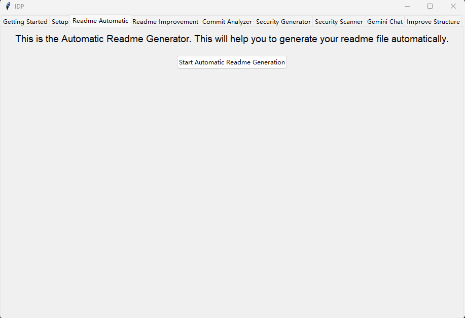

Readme Automatic
================

Introduction
------------

This section introduces the **Readme Automatic** tab.

Button
------

**Start Automatic Readme Generation**: Repo Shepherd will automatically check whether your repository contains a README file in Markdown format.

To ensure proper detection, the README file must:
    1. Be located at the root of the repository
    2. Be named "readme" (case-insensitive)
    3. Be a Markdown file

Once validated, the original README will be refined using a language model (LLM).

After the refinement process is complete, a popup will appear asking where to save the refined README file.
