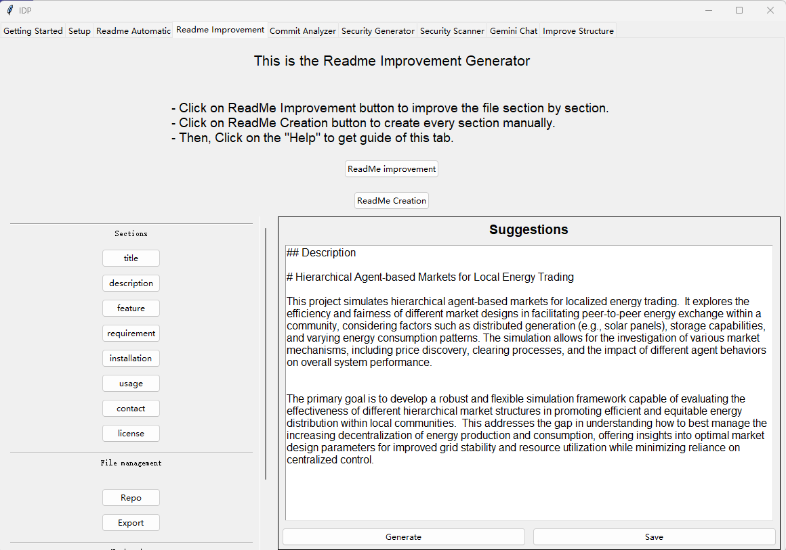

Readme Creation
==================

Introduction
------------

This section introduces the **Readme Creation** tab.

Left Frame: Sections Button
---------------------------

You can choose which sections you want to create.

Here only provide template sections: "Title", "Description", "Feature", "Requirement", "Installation", "Usage", "Contact", and "License"

**Section Name**: Click to view the text of that section in the "Original" panel.

Left Frame: File Management Buttons
-----------------------------------

**Repo**: Generates a file tree to help the LLM understand the structure of your repository.  
You can control the depth of the file tree and choose whether only folder names are included.

**Export**: Once you have refined and saved all sections, you can export the complete README.  
The LLM will compose all the refined sections into a valid Markdown README file.  
After generation, a popup will ask where to save the new file.  
In the popup, you can also rearrange the order of the sections.

Left Frame: Navigation Buttons
------------------------------

**Help**: Displays simple instructions for using this tab.

**Back**: Returns to the main tab.

Right Frame: Suggestions
------------------------

This frame displays the LLM-refined version of the README section.

You can edit the suggestion manually.  
Don't worry about formatting—the **Export** function will let the LLM compile all refined sections into a well-formatted Markdown README.

**Generate**: Use the LLM to refine the selected section.

**Save**: Save the refined section if you are satisfied with the result.
