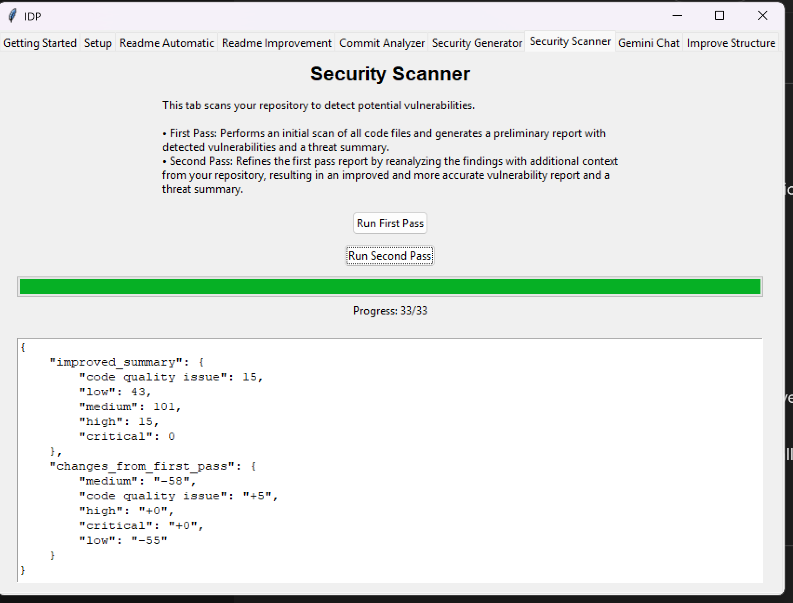

Security Scanner
===========

* **Functionality:** Utilizes the sellected ai model AI model to perform security analysis on the code files within the configured repository.
    * **First Pass:** Conducts an initial scan of each code file individually to detect potential vulnerabilities. It generates a preliminary report (`security_report.json`) containing identified issues and a summary of threats categorized by severity (e.g., low, medium, high, critical, code quality issue).
    * **Second Pass:** Refines the results from the first pass. It re-analyzes the initially detected vulnerabilities by providing the AI model with the broader context of the entire repository content. This pass generates an improved report (`improved_security_report.json`) which aims to reduce false positives and provide more accurate assessments. It also calculates a delta summary showing the changes in threat counts between the first and second passes.

* **Key UI Elements:**
    * **Run First Pass Button:** Initiates the initial file-by-file security scan.
    * **Run Second Pass Button:** Initiates the refinement scan, which requires the first pass to have been completed successfully.
    * **Progress Bar:** Visually indicates the progress of the current scan (either first or second pass).
    * **Progress Label:** Displays numerical progress (e.g., files processed / total files for the first pass, or batches processed / total batches for the second pass).
    * **Summary Text Area:** A `tk.Text` widget that displays the JSON output summary. After the first pass, it shows the initial threat summary. After the second pass, it shows the improved threat summary along with the delta changes compared to the first pass.

* **Usage Process:**
    * **First Pass:**
        * User clicks the `Run First Pass` button.
        * Buttons are disabled, the progress bar/label reset.
        * (Background: Repository initialized, code files extracted).
        * (Background: Each code file is sent to sellected ai model for vulnerability analysis).
        * The progress bar and label update as each file is processed.
        * Once complete, the initial threat summary (JSON) is displayed in the `Summary Text Area`.
        * A file named `security_report.json` containing the detailed findings is saved in the application's directory.
        * A success message is shown. Buttons are re-enabled.
    * **Second Pass:**
        * User clicks the `Run Second Pass` button (requires `security_report.json` to exist).
        * Buttons are disabled, the progress bar/label reset.
        * (Background: Repository initialized, `security_report.json` loaded, entire repository content converted to text and uploaded to sellected ai model for context).
        * (Background: Vulnerabilities from the first pass are sent to sellected ai model *in batches* along with the repository context for refinement).
        * The progress bar and label update as each batch is processed.
        * Once complete, the *improved* threat summary and the *delta* summary (JSON) are displayed in the `Summary Text Area`.
        * A file named `improved_security_report.json` containing the refined findings is saved in the application's directory.
        * A success message is shown. Buttons are re-enabled.

* **Output:**
    * **UI Display:** A JSON summary of identified threats (initial summary after the first pass, improved/delta summary after the second pass) is shown in the text area within the tab.
    * **File Output:**
        * `security_report.json`: Saved after the first pass, containing the initial detailed vulnerability findings per file and the threat summary.
        * `improved_security_report.json`: Saved after the second pass, containing the refined vulnerability findings per file and the final threat summary.

* **Dependencies:** Requires a valid API key and a repository path/URL configured in the `Setup` tab. The accuracy of the scan depends on the capabilities of the selected sellected ai model model, the complexity of the code, and the quality of the context provided in the second pass.
