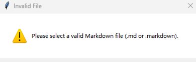
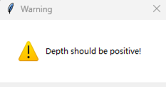
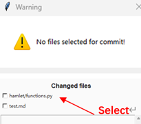
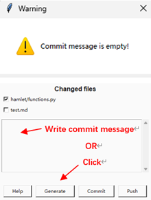
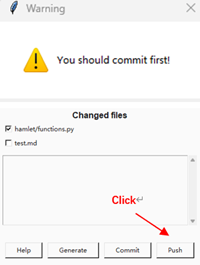
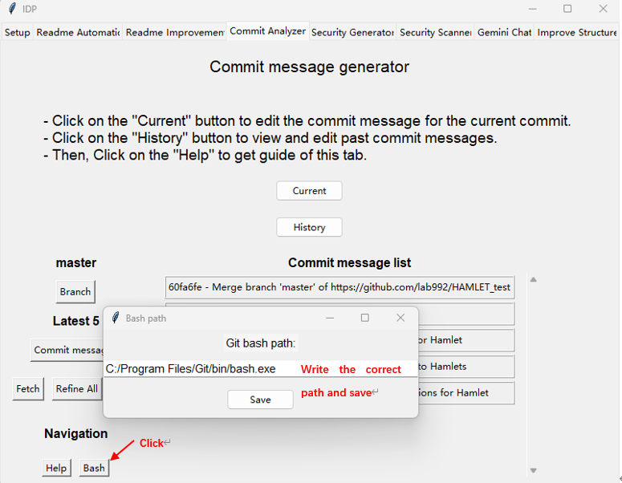

Troubleshooting
==========

1. Readme Improvement:

**Error: "Please select a valid Markdown file (.md or .markdown)"**

Cause: You haven't select a valid Markdown file.

Solution: Ensure that your repo has a valid README markdown.

Reference image: 

2. Readme Improvement & Creation:

**Error: "Please select a valid Markdown file (.md or .markdown)"**

Cause: Depth should be positive!.

Solution: Enter positive depth. If depth you enter is bigger than the max depth of your repo. The program will automatically use max depth instead.

Reference image:

3. Commit Analyzer - Current

**Error: "No files selected for commit!"**

Cause: Commit message is based on code diff. You should first select changed files with code diff.

Solution: Select change files.

Reference image:

4. Commit Analyzer - Current

**Error: "Commit message is empty"**

Cause: You cannot commit an empty message.

Solution: Generate commit message by clicking 'Generate'. Or write commit message manually.

Reference image:

5. Commit Analyzer - Current

**Error: "You should commit first!"**

Cause: No commited file detected.

Solution: Click 'Commit'.

Reference image:

6. Commit Analyzer - Histroy

**Error: "No commits fetched."**

Cause: You haven't fetched commit. Fetch first.

Solution: Click 'fetch'.

Reference image:

7. Commit Analyzer - History

**Error: "No edited commits to process"**

Cause: You haven't refined any commit message.

Solution: Click 'Refine all' or click single commit message on right frame to refine.

8. Commit Analyzer - History

**Error: "No branch selected. Please select a branch first."**

Cause: You haven't selected branch.

Solution: Click 'Branch' to select one.

9. Commit Analyzer - History

**Error: "Invalid commit selection"**

Cause: Commit selection parameter is wrong. Ensure the number is a digit.

Solution: Edit the number to a correct one.

10. Commit Analyzer - History

**Error: " usage: git filter-branch [--setup ] [--subdirectory-filter ] [--env-filter ]**

[--tree-filter ] [--index-filter ]

[--parent-filter ] [--msg-filter ]

[--commit-filter ] [--tag-name-filter ]

[--original ]

[-d ] [-f | --force] [--state-branch ]

[--] [...]

bash: if [ "$GIT_COMMIT" = "f8e4a335625b2c6e7300837f6f2cffda299a4a5a" ];

then

echo "[feat] Introduce new mathematical functions for Hamlet TEST"

echo ""

echo "Reason for Change: To enhance the functionality of Hamlet by adding new mathematical functions, enabling users to perform more complex calculations and analyses."

echo ""

echo "What was done: Introduced the get_one_plus_one function in the functions.py file, replacing the previously unused get_two_plus_two function. Removed the unused get_OK function and updated the constants.py file to remove the unused K_TEST constant."

echo ""

echo "Impact/Benefits: This change expands Hamlets capabilities, allowing users to perform more advanced calculations and analyses, ultimately enhancing the tools utility and value."

else cat

fi: No such file or directory"

Cause: Git Bash path is wrong.

Solution: Edit the number to a correct one.

Reference image:

